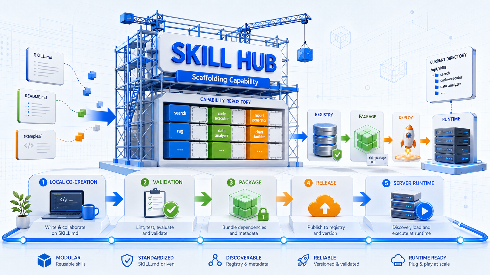

# Skill Hub

<p align="center">
  
</p>

<p align="center">
  <strong>像管理软件包一样管理 Agent Skill</strong><br>
  <span>共建 · 校验 · 打包 · 发布 · 部署 · 运行时加载 · 回滚</span>
</p>

<p align="center">
  <a href="AGENTS.md"></a>
  <a href="DEPLOYMENT.md"></a>
  <a href="SKILL_RELEASES.md"></a>
  <a href="LICENSE"></a>
</p>

一个面向多 Agent、企业自建 Agent 和服务器运行时的通用 Skill Hub。

它不是简单的提示词集合，也不是某个 Agent 的私有配置目录，而是一个可以像软件一样经历共建、校验、打包、发布、部署、加载和回滚的 Agent 能力目录。

## 自然语言安装

现在很多 skill 安装不再需要使用者手动敲命令，而是直接交给当前 Agent 完成。你可以把下面这段话发给 Claude Code、Codex、OpenClaw 或其他具备文件操作能力的 Agent：

```text
请帮我从这个仓库安装 <skill-name> skill 到当前 Agent：

https://github.com/linshidream/skill-hub

要求：
1. 先阅读 README.md、USAGE.md 和 registry.json。
2. 在 registry.json 中找到 <skill-name> 对应的 skill 目录。
3. 根据当前 Agent 类型选择合适的安装位置。
4. 安装完成后告诉我 SKILL.md 的最终路径。
5. 不要修改无关文件，不要自动提交 git。
```

如果你还不确定要安装哪个 skill，可以这样说：

```text
请读取 https://github.com/linshidream/skill-hub 的 registry.json 和 SKILL_RELEASES.md，告诉我当前有哪些 skill 可以安装，并根据我的任务推荐一个。
```

`<skill-name>` 来自 [SKILL_RELEASES.md](SKILL_RELEASES.md) 或 [registry.json](registry.json)。命令行安装方式见 [USAGE.md](USAGE.md)。

## 完整设计思路

Skill Hub 的目标是把“用户和 Agent 在真实任务中共同探索出的能力”沉淀成可复用、可审计、可部署的 skill，并让这些 skill 能被不同运行环境读取：

```text
本地共建
  -> skill 校验
  -> hub 级构建
  -> release 包
  -> 服务器部署目录
  -> 企业 Agent 运行时加载
  -> 版本回滚
```

在本地，`skills/` 保存每个 skill 的源码、说明、脚本、样例和 agent 适配文档；在构建阶段，仓库会生成带版本号的 release 目录、压缩包、校验和、skill 包和机器可读索引；在服务器上，release 会被部署到稳定目录，并通过 `current` 指针暴露给企业 Agent 服务。

推荐服务器运行目录：

```text
/opt/skill-hub/
├── releases/
│   ├── <release-id>/
│   └── <release-id>/
└── current -> releases/<release-id>
```

企业 Agent 服务只需要读取：

```text
/opt/skill-hub/current/registry.json
/opt/skill-hub/current/skills/<category>/<skill-name>/SKILL.md
```

这样 Spring AI Alibaba、Claude Code、OpenClaw、Codex 或其他自建 Agent 都可以基于文件系统、`Resource`、classpath、挂载卷、对象存储同步目录等方式加载同一套 skill。

根 README 不维护具体 skill 清单。具体 skill 名称、发布时间、版本和状态统一维护在 `SKILL_RELEASES.md` 与 `registry.json`。

## 文件索引

- [AGENTS.md](AGENTS.md)：给 Codex、Claude Code、OpenClaw 等 agent 读取的项目协作规则。
- [CLAUDE.md](CLAUDE.md)：Claude Code 入口说明，指向通用 agent 规则。
- [SKILL_RELEASES.md](SKILL_RELEASES.md)：技能增量记录、发布时间、版本和入口。
- [USAGE.md](USAGE.md)：通用安装、校验、打包和安全说明。
- [DEPLOYMENT.md](DEPLOYMENT.md)：构建、发布、部署、服务器目录和回滚方案。
- [CONTRIBUTING.md](CONTRIBUTING.md)：新增或修改 skill 的贡献规范。
- [SECURITY.md](SECURITY.md)：安装和运行第三方 skill 前的安全检查说明。
- [registry.json](registry.json)：机器可读的 skill 注册表，供安装器、CI 和索引工具使用。
- [adapters/](adapters/)：企业框架或不同 agent 的运行时加载适配说明。
- [deploy/](deploy/)：Docker、Compose、systemd 等部署模板。
- [schemas/](schemas/)：注册表和 skill 元数据的 JSON Schema。
- [scripts/](scripts/)：安装、校验、打包等仓库级脚本。
- [skills/](skills/)：每个 skill 的实际目录。
